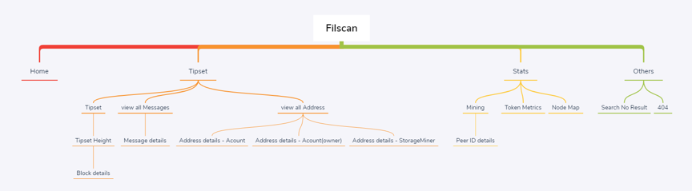
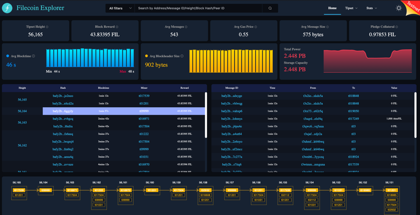
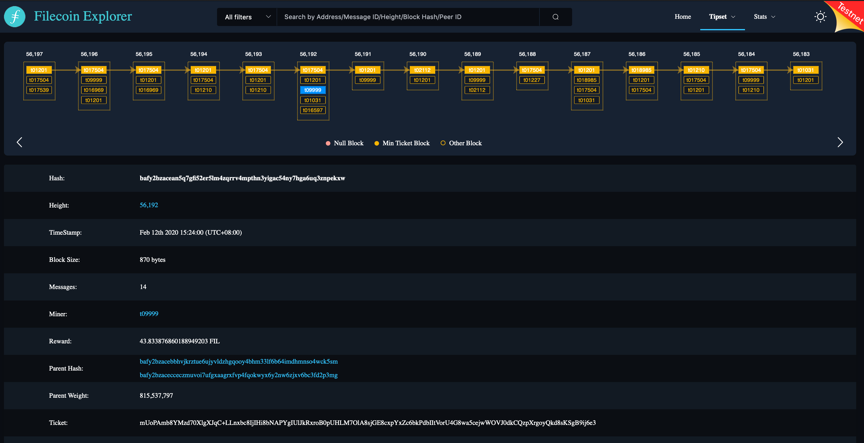
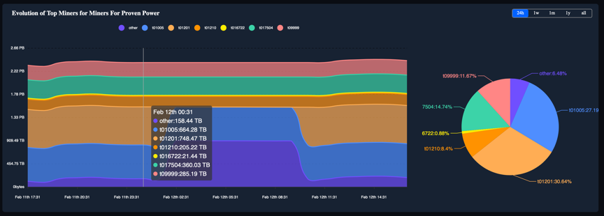
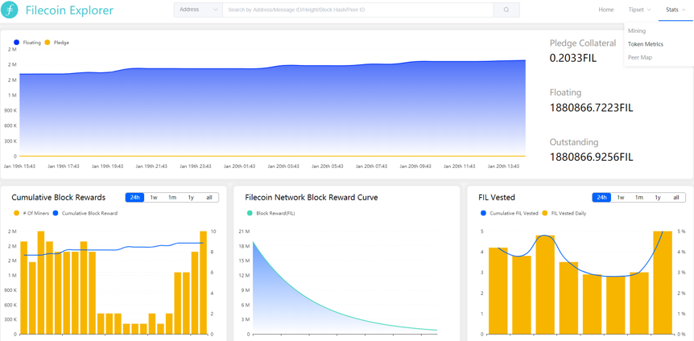
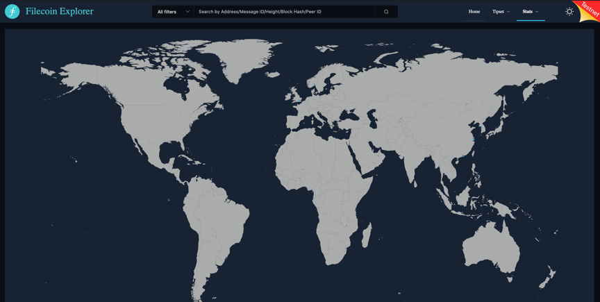

# Overview

Filscan is a blockchain browser for Filecoin, which can be used to view Filecoin blockchain data, including querying addresses, messages information, block heights, miner information, token information, etc.

# Table of Contents
- [Overview](#overview)
- [Table of Contents](#table-of-contents)
- [Front-End](#front-end)
  - [Recommended Browser](#recommended-browser)
  - [User Guide](#user-guide)
    - [Comments](#comments)
    - [Site Map](#site-map)
    - [Home Page](#home-page)
    - [Tipset Page](#tipset-page)
    - [Mining Page](#mining-page)
    - [Token Metrics](#token-metrics)
    - [Peer Map](#peer-map)
  - [Install](#install)
    - [Environmental requirements](#environmental-requirements)
    - [Install Dependencies](#install-dependencies)
    - [Compiles and hot-reloads for development](#compiles-and-hot-reloads-for-development)
    - [API Environment Configuration](#api-environment-configuration)
    - [Build](#build)
    - [Lints and fixes files](#lints-and-fixes-files)
    - [Customize configuration](#customize-configuration)
- [Back-End](#back-end)
  - [Build and Install](#build-and-install)
    - [Environment](#environment)
    - [System Require](#system-require)
    - [Build](#build-1)
    - [Configuration](#configuration)
    - [Run](#run)
  - [API Document](#api-document)

# Front-End

## Recommended Browser

For the best experience with the Filscan, we recommend that use the latest version of a browser from this list:

•       Microsoft Edge

•       Mozilla Firefox

•       Google Chrome/Chromium

•       Apple Safari

## User Guide

### Comments

**Active Miner:** the active miner is the miner that has made sector in the last 24 hours.

**Active Peer:** the active peer is the node that has sent messages in the last 24 hours.

### Site Map

<p align="center">
  
</p>

### Home Page

<p align="center">
  
</p>

You will get the latest chain status of Filecoin Blockchain, include the latest block&message table, the Tipset chain chart.

**Search Bar:**

It is convenient for users to query the blockchain data. User can query detail information about Address, Tipset Height, Block Hash, Message ID, Peer Id by search bar.

**Navigation Bar:**

It is an easy way to access the page you are interested in.

**Chain status:**

Shows the latest chain status.

**The latest Blocks & Messages:**

Shows the latest Blocks info & messages on chain.

**BlockChain structure chart:**

Shows the chain structure of the Filecoin.

### Tipset Page

<p align="center">
  
</p>

In this page user will see the chain struct and if click the block in the tipset, the block detail info will appear.

### Mining Page

**Active Storage Miners:**

The chart shows the count of active miners in different periods.

**Evolution of Top Miners for Miners For Proven Power:**

<p align="center">
  
</p>

The chart shows the Proven power of the top miners in different time periods.

**Miner List**

<p align="center">
  
</p>

the table shows some miner key info, some of columns can be sorted. User can choose periods to show different data.

### Token Metrics

<p align="center">
  
</p>

The page displays the block reward and pledged amount of FIL tokens.

### Peer Map

<p align="center">
  
</p>

This page shows the peer’s location on the map.

## Install

### Environmental requirements

- required: Node.js(https://nodejs.org/en/)

- optional : Yarn (https://yarnpkg.com/)

### Install Dependencies
```
yarn install or npm install 
```
### Compiles and hot-reloads for development
```
yarn serve or npm run serve
```
### API Environment Configuration

By default, the profiles are in the root directory of the project. You can modify the value of **VUE_APP_BASE_URL** to change the server address.

**Example:**

If you want to change the server address, you can open the file .env.development. Then you will see the default value of **VUE_APP_BASE_URL** is "http://192.168.1.2:8700/v0/filscan", modify it according to your actual server address. Please notice that you should run "yarn serve" or "npm run serve" to apply this change.

### Build
```
yarn build:pro or npm run build:pro
```
### Lints and fixes files
```
yarn lint or npm run lint
```
### Customize configuration

See Configuration Reference(https://cli.vuejs.org/config/).

# Back-End

## Build and Install

### Environment

- golang >= v1.13
- mongo >= v4.2
- lotus >= v0.2.7

### System Require

- Linux or Mac OS

### Build
```
git clone (githuburl)

cd Backend

make build-lotus

go build
```
### Configuration

Edit app.conf in path /conf and set the correct parameter
```
mongoHost = "127.0.0.1:27017"

mongoUser = "root"

mongoPass = "admin"

mongoDB   = "filscan"

lotusGetWay="192.168.1.1:1234"
```
### Run

Make sure mongo and lotus is active, and run the filscan_lotus
```
./filscan_lotus
```
The application will check lotus and mongo’s status. The application will stop if got any error from them. If application start success, it will work until sync all data down from lotus. 

## API Document

Check document [here](Filscan_Interface_v1.0.md)
